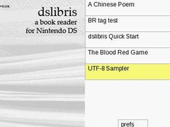

Herein lies the source for *dslibris*, an [EPUB](http://idpf.org/epub)
ebook reader for the Nintendo DS.




# Releases

See the Releases section for a program ready to be DLDI patched and copied to your cartridge media. The release file also contains a file structure for books and fonts that you should also copy. All files and directories must be in the root directory of your media.

# Development

## Prerequisites

devkitPro pacman packages:

    (dkp-)pacman -S devkitARM libnds libfat nds-expat nds-bzip nds-zlib

Ubuntu 16.04 LTS and macOS are known good development platforms. CentOS and MinGW have also worked, but haven't been checked recently.

## Building

To build the program,

```shell
make
```

`dslibris.nds` should show up in the top directory.

## Installation

See INSTALL.

## Debugging

arm-eabi-gdb, insight-6.8 and desmume-0.9.12-svn5575 have been known to work for debugging. See online forums for means to build an arm-eabi-targeted Insight for your platform.

# See Also

https://rhaleblian.wordpress.com/dslibris-an-ebook-reader-for-the-nintendo-ds/

http://devkitpro.org

http://idpf.org/epub
