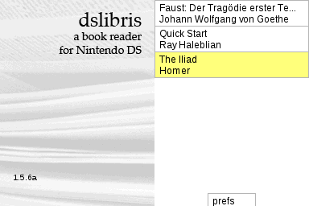
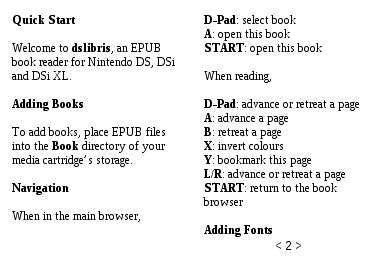
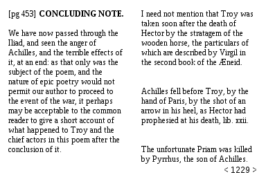

Herein lies the source code for **dslibris**, an
[EPUB](https://en.wikipedia.org/wiki/EPUB)
ebook reader for the Nintendo DS, DSi and DSi XL.

# Releases

Download the zip file in the Releases section.

# Installation

See the
[Quickstart](https://github.com/rhaleblian/dslibris/wiki/User:-Quickstart)
page in the Wiki.

# Development

## Prerequisites

Install devkitPro's toolchain for ARM, aka `devkitARM`.
Then install the required devkitARM packages:

    sudo dkp-pacman -S $(cat pacman.txt)

## Building

To build the program, assure devkitARM is available to your shell:

    . /opt/devkitpro/devkitarm.sh

then

    make

`dslibris.nds` should show up in the top directory.

# See Also

Blog: <http://ray.haleblian.com/wordpress/dslibris-an-ebook-reader-for-the-nintendo-ds/>

Development Tools: <http://devkitpro.org>

EPUB/W3C/IDPF: [http://idpf.org](https://idpf.org/)
